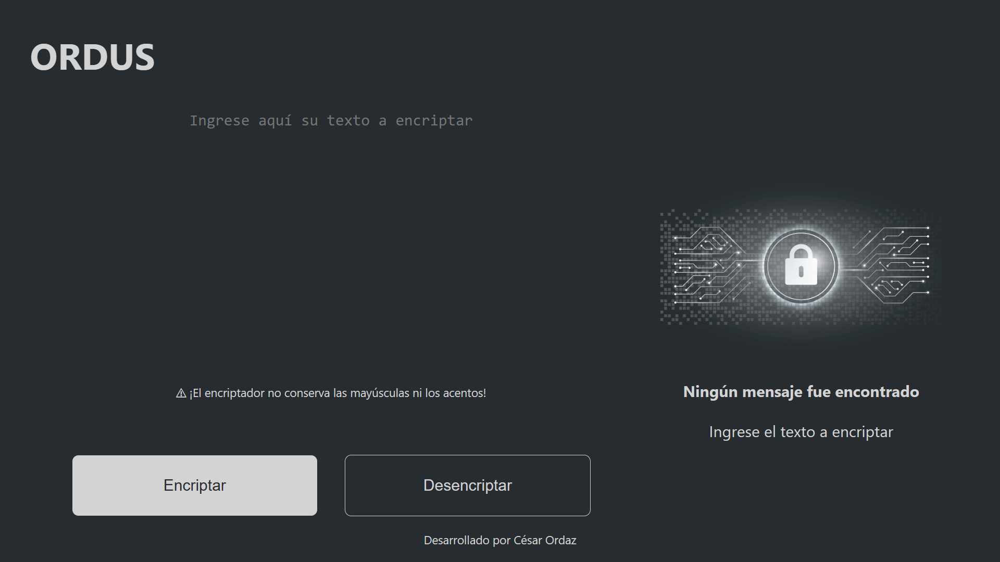
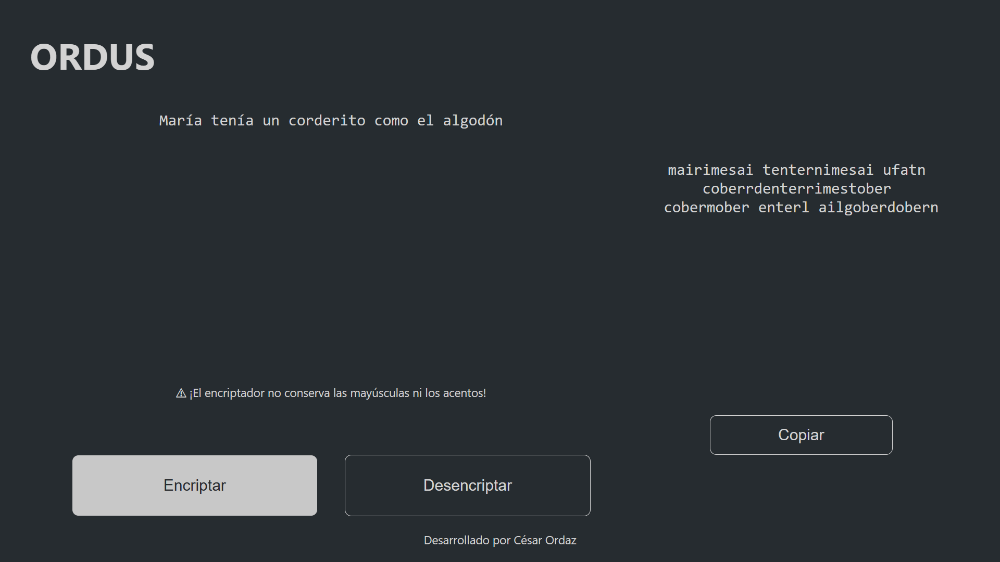
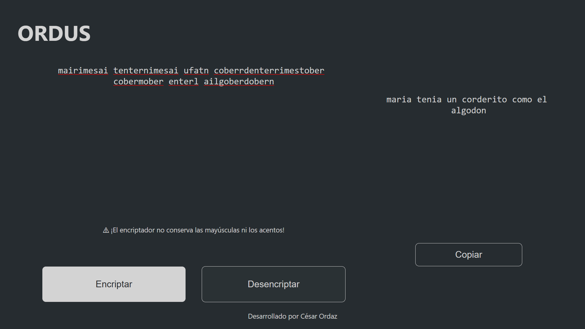
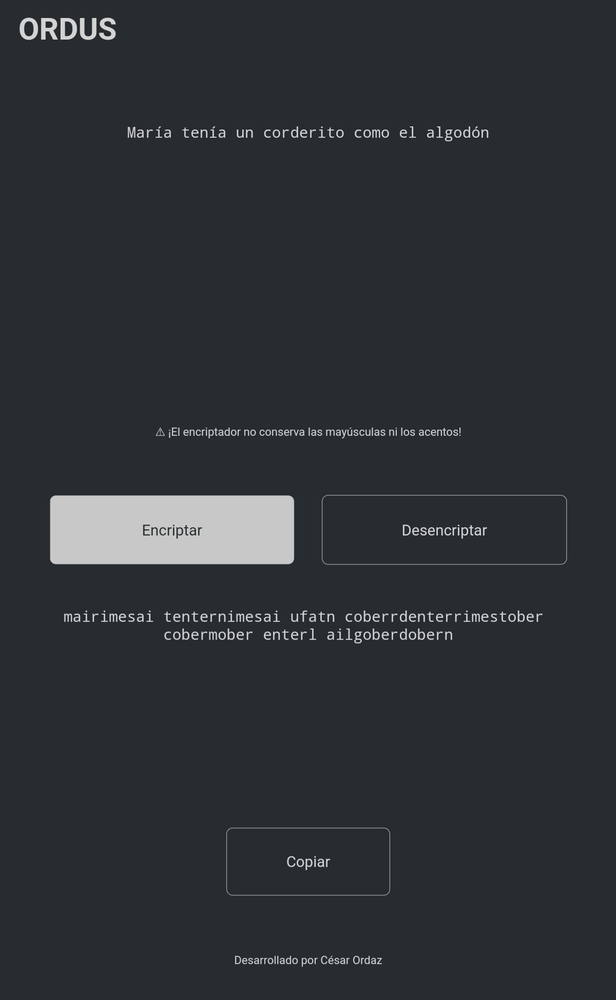
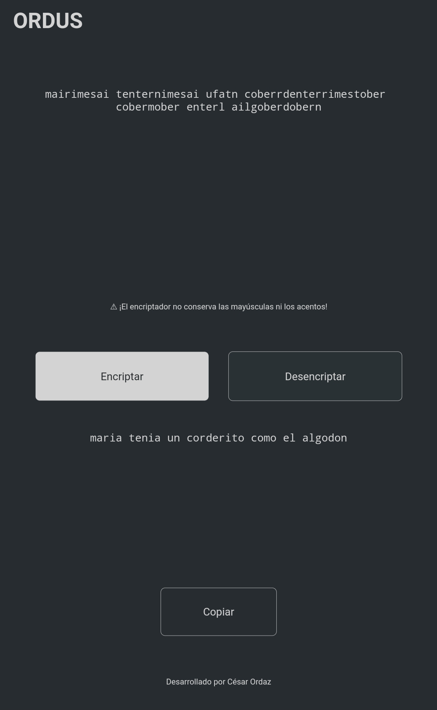
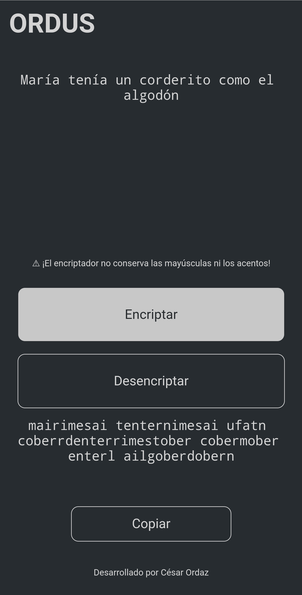
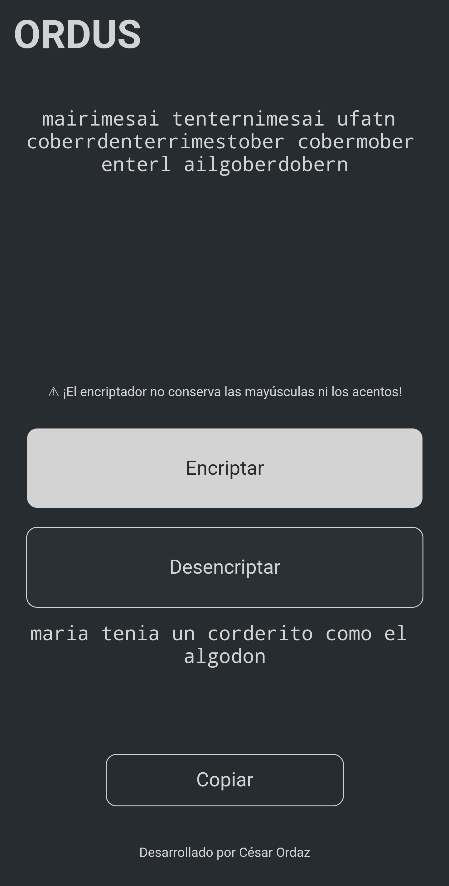
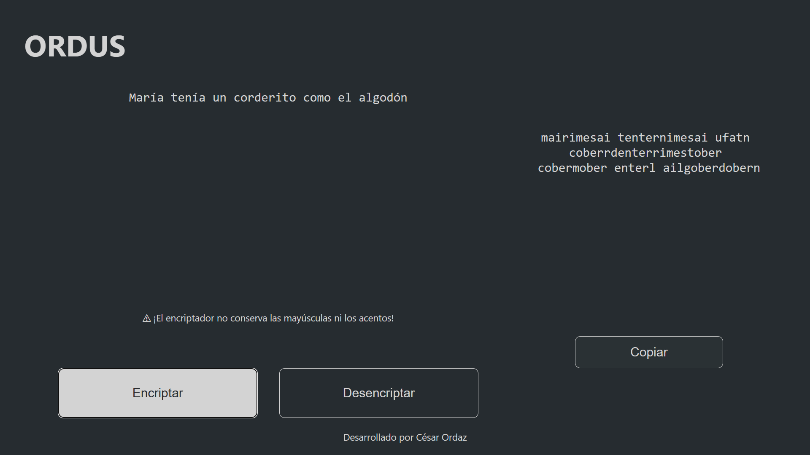

# ONE Challenge 1

Este proyecto responde al challenge: [Challenge ONE - Principiante en programación](https://www.aluracursos.com/challenges/challenge-one-logica) para el grupo G5 del programa [Oracle Next Education](https://www.oracle.com/mx/education/oracle-next-education/) ofrecido por [Alura Latam](https://www.aluracursos.com/) en conjunto con [Oracle](https://www.oracle.com/mx/).

El proyecto consiste en un pequeño encriptador-desencriptador implementado sobre JS y HTML-CSS para la interfase de usuario.

## Responsivo
Desarrollado con responsividad en mente el encriptador se adapta a pantallas de escritorio:

tabletas:

y teléfonos móviles:

## Copiar
El encriptador cuenta con la opción de copiar el texto encriptado-desencriptado.

## Método de cifrado
La base del encriptado es la sustitución de los caracteres:

* `a` por `ai`
* `e` por `enter`
* `i` por `imes`
* `o` por `ober`
* `u` por `ufat`

El encriptador no respeta mayúsculas ni acentos.

Se espera en un futuro agregar un método de cifrado más robusto.